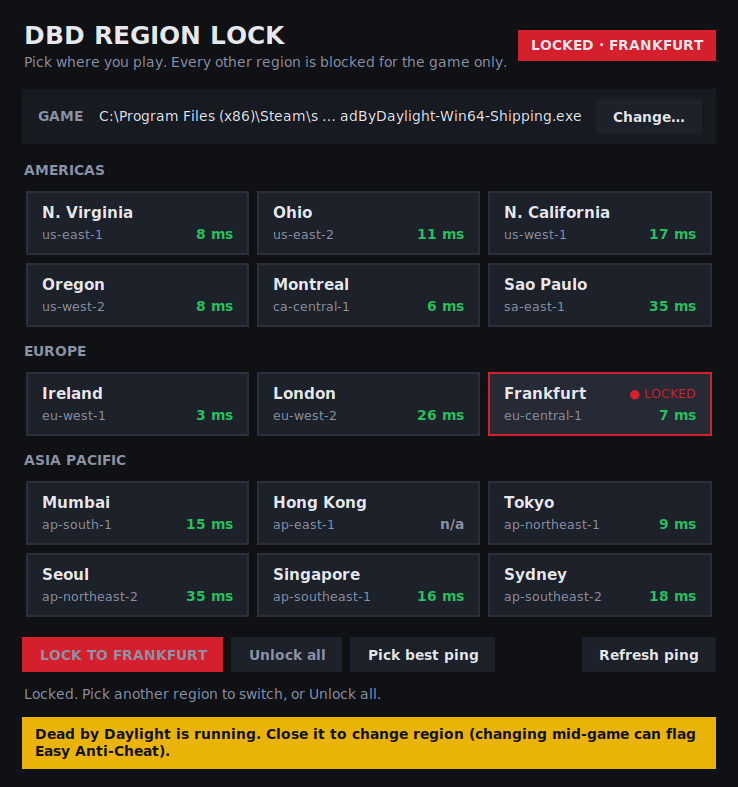

# DBD Region Lock

Pick the Dead by Daylight server region you want to play in. The app uses your
own firewall to stop the game from reaching every other region's latency
beacon, so matchmaking only ever sees the region you picked. Built for Windows;
also works on Linux with Steam Proton.

> **Always close Dead by Daylight before locking or unlocking, then launch it.**
> The app refuses to change anything while the game is running, because
> changing firewall rules mid-game can flag Easy Anti-Cheat.

## How it works

DBD chooses a matchmaking region by pinging Amazon GameLift beacons
(`gamelift.<region>.amazonaws.com`, `gamelift-ping.<region>.api.aws`) in every
region and picking the lowest latency. This app resolves the beacons of every
region **except** the one you choose and adds firewall rules that block them:

| Platform | Mechanism | Scope |
| --- | --- | --- |
| Windows | Windows Defender Firewall outbound rules, one per blocked region, named `DBD Region Lock - <region>` | Only the DBD executable (`program=`). Rules persist across reboots. |
| Linux / Proton | An nftables table `inet dbd_region_lock` | System-wide, but only for GameLift beacon IPs, which serve nothing else. Cleared on reboot. |

The app never touches the game process, its memory or its files. It only adds
firewall rules, which is the same thing as a user editing their own firewall.

Safeguards:

- **Game must be closed.** Lock and Unlock are disabled while any DBD build
  (Steam, Epic, Microsoft Store, or Proton) is running, and a yellow banner
  says so.
- **Auto-refresh.** Beacon addresses rotate. While the app is open and the game
  is closed, it re-checks every 60 seconds and blocks any new addresses. It
  only ever adds rules, so the lock is never lifted. (On Linux this runs only
  when the app runs as root, to avoid repeated password prompts.)
- **Hosts-file cleanup.** Old hosts-file region changers leave `gamelift`
  entries in `C:\Windows\System32\drivers\etc\hosts` that fight the lock.
  Lock and Unlock remove them (a backup is saved as
  `hosts.dbd-region-lock.bak`) and flush the DNS cache.
- **Real ping.** Latency is measured the way the game does it: a UDP echo to
  each beacon on port 7770. If your network drops that, it falls back to a TCP
  handshake so you still see a number.

## Windows: run it right away

**Option A: download the .exe (no install).** Open the repository's
**Releases** page, download `DBDRegionLock.exe` from the `latest` release and
double-click it. Accept the admin prompt (firewall rules need admin rights).
Windows SmartScreen may warn because the file is not code-signed: click
**More info → Run anyway**.

**Option B: run from source.** Install Python 3.10+ from python.org (tick
"Add python.exe to PATH"), then double-click `Start DBD Region Lock.bat`.

**Build the .exe yourself:** double-click `build_windows.bat`; the file
appears in `dist\DBDRegionLock.exe`. GitHub Actions also builds it on every
push (see `.github/workflows/build.yml`).



### Using it

1. The **GAME** bar shows the detected executable (Steam, Epic, Microsoft
   Store / Game Pass). If it says *Not found*, click **Change…** and pick
   `DeadByDaylight-*-Shipping.exe` in `...\DeadByDaylight\Binaries\Win64`
   (or `WinGDK` for the Microsoft Store version).
2. Click a region card. Pings are colour-coded (green < 80 ms, yellow < 150 ms,
   red above). **Pick best ping** selects the fastest one for you.
3. Press **LOCK TO …**. The badge top-right turns red and the card shows
   **● LOCKED**. Restart the game if it was running; the app tells you.
4. **Unlock all** removes every rule the app created.

The ping on the cards is measured by this app, not the game, so it still shows
real latency to blocked regions.

## Linux (Steam Proton)

```sh
sudo python3 -m dbd_region_lock               # GUI (needs python3-tk)
sudo python3 -m dbd_region_lock lock eu-west-1
sudo python3 -m dbd_region_lock unlock
```

Without root it runs `nft` through `pkexec` or `sudo`. Requires nftables.

## Command line (both platforms)

```
python -m dbd_region_lock regions              # list regions and latency
python -m dbd_region_lock lock <region> [--exe PATH]
python -m dbd_region_lock unlock
python -m dbd_region_lock status
```

## Notes and limitations

- **Anti-cheat:** Easy Anti-Cheat protects the game process. This app never
  interacts with that process; it only changes OS firewall rules, and region
  selectors that work this way are widely used. That said, no third-party
  tool can guarantee how Behaviour Interactive treats it, so use at your own
  discretion.
- Beacon addresses can change over time. The app refreshes the block every
  minute while it is open; if you lock and close the app, open it again (or
  press **Lock** again) before playing if a blocked region shows up.
- If you used a DNS-proxy method (such as Acrylic DNS Proxy) before, undo it
  first: it changes what the beacons resolve to.
- Locking to a far-away region means high ping in matches, and queues can be
  longer in small regions.
- Locking does not change the region of a lobby you are already in; restart
  the game after locking or unlocking.

## Customizing

- **Regions:** `dbd_region_lock/regions.py` is one list; add, remove or rename
  entries there and the app and CLI pick them up.
- **Look:** the colours, ping thresholds and number of card columns are
  constants at the top of `dbd_region_lock/gui.py`.
- **Firewall logic:** `dbd_region_lock/firewall/windows.py` (netsh) and
  `firewall/linux.py` (nftables).

## Tests

```sh
pip install pytest
python -m pytest
```
